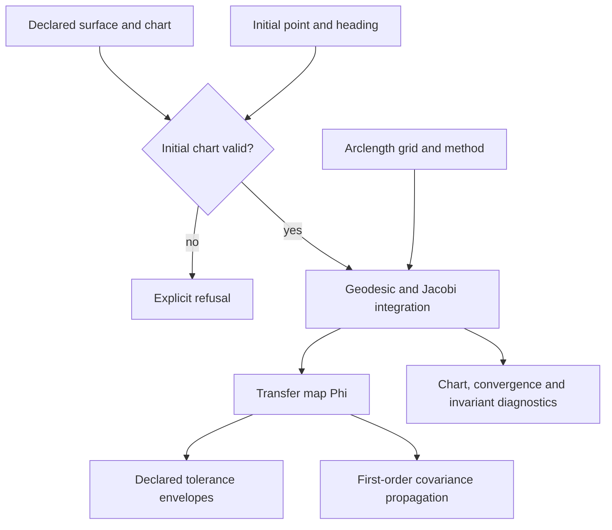

# Curved-Surface Geodesic Sensitivity Runtime

Part of **Notation Systems' computational instrumentation and evidence infrastructure** for industrial and cyber-physical systems.

[Stack map](https://github.com/giasonpooni/Computational-Instrumentation-Workbench/blob/main/docs/STACK.md) · [Component role and interfaces](docs/STACK_ROLE.md)

**How a small error in how a path is started grows into a deviation further
along a curved surface — and exactly how far that prediction can be trusted.**

Path sensitivity for curved-surface manufacturing and robotic inspection, in
two layers: deterministic tolerance contracts on top, and a numerical engine
underneath checked against closed-form references, convergence behavior and
declared numerical invariants.

## Parametric-surface computation



Solid arrows show the implemented parametric-surface path. A chart exit during integration is reported in diagnostics. The transfer coordinates are transverse offset and heading; deterministic tolerance bounds and covariance propagation are separate uses of that map. Reference checks support numerical scope only: this repository supplies neither a triangle-mesh solver nor physical validation.

[Instrumentation diagram atlas](https://github.com/giasonpooni/Computational-Instrumentation-Workbench/blob/main/docs/DIAGRAMS.md).


## The object

A starting pose can be wrong in two ways: the tool begins *beside* the nominal
path, or *pointed away* from it. Both propagate through the same equation,

```text
j''(s) + K(gamma(s)) j(s) = 0
```

so the two fundamental solutions assemble into a transfer map

```text
        | a(s)   b(s) |          | lateral(s) |          | lateral(0) |
Phi(s) = |             |          |            | = Phi(s) |            |
        | a'(s)  b'(s)|          | heading(s) |          | heading(0) |

a(0)=1, a'(0)=0     (lateral offset)
b(0)=0, b'(0)=1     (heading error)
```

which carries a tolerance box, or a covariance, from the start of the path to
anywhere along it. It also carries its own invariant: the equation has no
first-derivative term, so `det Phi = a b' - a' b = 1` exactly, at every arc
length, on every surface — a quantity the solver never enforces and whose
drift is therefore a free measure of how well it is integrating.

### Numerical covariance boundary

Starting-pose, observation-model, measurement-record, and temporal-filter
covariances use one native numerical validator. Variances must be finite and
nonnegative; an exactly zero variance requires an exactly zero row and column.
For positive-variance coordinates, symmetry and PSD checks use dimensionless
correlations with tolerances `1e-12` and `1e-12`, respectively. Each stored
triangle must pass. No averaging, eigenvalue clipping, jitter, or uncertainty
floor repairs the supplied matrix. Consequently a tiny invalid covariance is
not accepted merely because its entries fall below an absolute threshold.

Every returned covariance is checked again in its output coordinates, including
each sample in propagated stacks and the final observation covariance after
noise is added. Input eligibility alone is insufficient: a transformation can
amplify tolerated asymmetry into an invalid output. Such an output is refused,
not repaired; exactly representable singular cancellations remain valid.
For computed zero variances, an exact quadratic-form diagnostic over the
declared floating-point values distinguishes a genuine singular zero from
nonzero uncertainty erased by cancellation. It only refuses false zeros;
it never substitutes a computed variance or alters the numerical solver.

Valid singular and mixed-unit covariances remain supported, including
`[[1e-14, 1e-7], [1e-7, 1]]`. Boolean/string coercion, unrepresentable variances,
and nonfinite propagation results are refused. Propagation refuses negative
computed variances, including cancellation beyond representable precision,
rather than clipping them. Floating-point underflow during covariance
congruences is also refused: nonzero uncertainty must not silently become an
exact zero. This is conservative even for negligible intermediate terms.
Resolvability additionally requires positive noise
variance in every reported output; singular covariance does not authorize
division by zero. Eligibility close to the dimensionless threshold remains
floating-point dependent and does not establish calibration, independence,
model adequacy, or physical validity.

This tightens numerical acceptance without rewriting retained report schemas,
source digests, observation modes, or historical operation identities.

## Verification

**345 declared checks across two stages, 0 failed.** Every number below has a
threshold attached in `engine/experiment.py` or `engine/experiment_surfaces.py`,
and the committed reports are regenerated and compared in CI.

### Stage one — constant curvature, where closed forms exist

All three surfaces are carried in one ambient chart, so the geodesic equation,
the exponential map, the distance function and the Jacobi reference each become
a single formula in `K` built from `sn_K = s, sin s, sinh s`.

| what was measured | result |
|---|---|
| order of accuracy, Euler / midpoint / RK4 | 1.02 / 1.96 / 3.93 (sphere), 0.97 / 1.98 / 3.97 (hyperbolic) |
| Wronskian drift order, same three methods | 0.97-1.03 / 3.000 / 4.998-5.002 — and matching the exact `\|d^n - 1\|` to 1e-11, 7e-6, 8e-7 |
| flat model | every method exact to `< 1e-13`; no order exists to measure, and the report says so |
| separation of two geodesics | `sn_K(d/2) = sn_K(s)·sin(eps/2)` — one law of cosines for all three curvatures |
| error of the first-order prediction | grows as `eps^2` with coefficient `cn_K(s)^2/24`, matched to 2e-5 … 4e-4 relative |
| first-order validity at `s = 1`, to 1e-6 | `eps <= 0.52°` (sphere), `0.28°` (plane), `0.18°` (hyperbolic) |
| conjugate point on the sphere | found at `s = 3.141592653589791`, error 2.2e-15 |
| loss of minimality past it | excess length matches `2(s - pi)` to 7.1e-15 |

The Wronskian row is worth a second look. Each fixed-step method has an exact
one-step determinant — `1 + Kh^2` for Euler, `1 + K^2h^4/4` for midpoint,
`(1 - Kh^2/2 + K^2h^4/24)^2 + K(h - Kh^3/6)^2` for RK4 — and the determinant of
a product is the product of determinants, so `det Phi = d^n` with no
approximation anywhere. Three more cleanly separated slopes, from a quantity
that needed no reference solution at all.

### Stage two — surfaces where the curvature varies

A parametric surface `r(u, v)` carries its own metric. From one jet come the
Christoffel symbols and the Gaussian curvature, and the geodesic and **both**
columns of `Phi` are advanced as one eight-component system. With no closed
form left, four things replace it:

| verification | result |
|---|---|
| **anchoring** — recover the known answers the general way | `b`: `s`, `s`, `sin s`, `sinh s` to 4.4e-13 or better; `a`: `1`, `1`, `cos s`, `cosh s` to 4.1e-13 or better |
| **two independent routes, twice** — `b` by perturbing the heading, `a` by moving the start point and parallel-transporting the direction | both second order in the perturbation on every surface, exponent 2.000 ± 0.001 |
| **self-convergence** — halve the step against a finer run | order 3.96 – 4.00 in `j`, 3.92 – 4.01 in the path, on every case with anything to converge |
| **invariants** — unit speed and `det Phi`, neither ever re-imposed | both hold to 2e-12 everywhere |
| **error budget** — halve the step and Richardson-extrapolate, per quantity | the estimate reproduces the *actual* error to 0.02% wherever a closed form leaves one to resolve, and the budget itself falls as `h^4` (observed order 3.99 – 4.00) |
| **the frame the record publishes** — Euler's theorem, `kappa_n(along) + kappa_n(across) = 2H` | machine precision on every surface, with no closed form needed |
| **the jet's step, along a whole path** | the transfer error spans four orders of magnitude over relative steps from 1e-2 to 1e-6; no step in the sweep invents or erases a focus |
| **the prediction chain** — naming the two second-order transformations between `Phi dz0` and an ambient chord | the disagreement with an independently flowed finite-difference chord falls from the size of the effect to 3e-10 or better, a factor of 3.8e3 to 1.4e6, on every surface where both corrections exist |
| **the uncertainty budget's curvature term** — `dj(s) = -∫ G(s,t) dK j(t) dt` through the Jacobi Green's function | reproduces an actual re-integration at the perturbed curvature, with the residual falling linearly in `dK` (order 1.000) — so it is the derivative, not something close to it |
| **the inbound boundary** — a path handed over as a `path-geometry-v1` file, written to JSON and read back | still reproduces `s`, `s`, `sin s`, `sinh s` through the adapter to 4.4e-13 or better, and the record it produces holds `det Phi = 1` to 2.5e-14 |
| **the declared curvature interpolation** — which curve fills `K` between the producer's samples | a numerical choice with an order: monotone cubic 3.8, piecewise-linear 1.9997, differing by a factor of 580 at the coarsest sampling in the ladder |
| **the validity envelope** — where the linear map stops holding, probed against the geodesic flow itself | reproduces `sqrt(24 tol / max(a² + κₙ² b²))` to 0.72% or better wherever `K` is constant, and re-probing at the bound the fit chose costs the declared tolerance to 1.3% on every surface including the two with no closed form |
| **the two forms of the observability Gramian** | `AᵀR⁻¹A` times the sample spacing approaches `∫ΦᵀHᵀR⁻¹HΦ ds`, the gap halving as the sampling doubles (ratios 1.991, 1.996); a correlated `R` carries 6.8% of the information an independent one of the same variance does |

Three results worth stating plainly:

- **A rolled sheet has exactly the path sensitivity of the flat sheet** — to
  1e-13, from a completely different parameterisation. Bending a sheet onto a
  drum changes nothing, because only intrinsic curvature carries a pose error.
- **Reconstructed 3-D points give chords, not distances in the surface.** The
  finite-difference route differs from the Jacobi equation at order `eps^2`
  with coefficient `(cn_K(s)^2 + kappa_n^2 sn_K(s)^2)/6` — the second term
  being the ambient chord. On the pseudosphere the chord term is 1.45 times
  the intrinsic one, so a chord measurement sees 2.5 times the coefficient an
  in-surface distance would — the same order as the first-order model's own
  failure. A camera does
  not even report that directly: it reports image coordinates, and a chord
  appears only after calibration, reconstruction and registration. Every
  comparison in the reports therefore names its **observation mode**.
- **The two columns focus at different places.** On a spherical cap `b`
  vanishes at `s = pi` and `a` at `s = pi/2`. A heading error and a lateral
  offset are not interchangeable.
- **A rigid transform of an imported path leaves the transfer map exactly
  alone** — 0.0, not 1e-16. That is a statement about *consumption*: it proves
  the adapter never reads a position, so an adapter that had started
  differencing positions to recover a tangent would fail rather than pass
  slightly worse. It is not on its own a proof of geometric invariance; the
  invariance that matters is `K`'s, and that is the upstream producer's to
  establish.
- **A rolled sheet has the plate's transfer map and not the plate's validity
  envelope.** Identical intrinsic curvature, identical `Phi` to 1e-13, and an
  envelope 15.7% tighter — because the measurement is an ambient chord and a
  cylinder has a transverse normal curvature the plate does not. The
  observation mode is usually stated as a warning; here it is a number.

### From the transfer map to something a sensor could have reported

`Phi(s) dz0` is a tangent vector. A scanner reports a chord between
reconstructed 3-D points. Between them sit two transformations, each second
order in the perturbation — the same order as the first-order model's own
failure — so skipping either does not give a worse answer, it gives one that
disagrees with the measurement by the size of the effect and reads as a model
failure.

```text
geometric transfer map  ->  intrinsic surface distance  ->  ambient chord  ->  instrument output  ->  whitened residual
```

Each stage carries **the transformation that produced it**, not just a label
for what it now is, and the chain runs forward only: a chord cannot be stepped
back into an intrinsic distance. Applying the two corrections drops the
disagreement with an independently flowed finite-difference chord from ~4e-6 to
below 3e-10 on every surface of constant curvature — the plate, the rolled
sheet, the spherical cap and the pseudosphere. Where the curvature varies only
the chord correction is computable, and the prediction *says so*, in its chain
and in `extra["intrinsic_correction"]`, rather than appearing complete.

The comparison at the end is not a maximum absolute error. That throws away the
covariance, and the covariance is where the information is: two residuals of
the same size are different evidence when one lies in a direction the
instrument resolves well. `residual_statistics` returns the full residual
covariance, the whitened residual and the chi-square — and a filtered
comparison gets one covariance over every scalar residual at once, because a
filter correlates arc lengths and keeping only the diagonal blocks would treat
as independent exactly the samples it made dependent.

### The starting pose is one term, and rarely the largest

A campaign that propagates `C0` and calls the result the total has bounded one
contribution. The surface was fitted to a scan, the part was fixtured against a
datum, the metrology frame was calibrated, the prediction was registered to the
measurement at *some* arc length, and the sensor's noise is not white.

Shape matters more than size, because most of those are **systematic**: one
unknown fit, one unknown offset, one unknown shift, each wrong in the same
direction at every sample. A systematic term is a rank-one covariance
`σ² v vᵀ`, not a per-sample variance, and the difference decides whether
measuring more of the path helps at all. On the declared example budget, 99.8%
of the worst-sample variance is systematic — which is the sentence an
instrument engineer needs before buying more samples.

Two terms are computable from the transfer record and nowhere else. A curvature
error enters through the Jacobi operator's own Green's function,

```text
dj'' + K dj = -dK j   =>   dj(s) = -∫₀ˢ [b(s)a(t) - a(s)b(t)] dK j(t) dt
```

with no Wronskian in the denominator, because `det Phi = 1` exactly — and it is
checked against an actual re-integration at the perturbed curvature. A
registration error is `dj = j'(s) ds`, largest where the prediction is
*steepest* rather than where it is largest. A budget of purely systematic terms
is singular, and correctly so: a perfectly correlated error is perfectly
predictable, so a campaign that forgot to declare its sensor noise finds out
there rather than three layers down.

The coupon programme that would test any of this is declared in
`engine/campaign.py` and has status `not-started`. It leads with the plate
against the rolled cylinder, because that stage is **differential** — the
calibration offset, the registration shift and the fixture datum are common to
the two coupons and cancel in the difference, so it can falsify the claim
before any absolute accuracy has been established. `conformance()` checks a
submitted set of trials against the structural rules: both perturbation axes
exercised, calibration and validation split by *coupon* rather than by run,
achieved perturbations reported rather than commanded ones, one observation
mode per stage, at least two scales. Conformance is bookkeeping and says
nothing about agreement — it is what would make a disagreement mean something.

### The decision, and what is allowed to make it

Of 24 candidate starting headings from one point on a torus, forward angular
error amplification `max |b(s)|` varies by a factor of **21** over the same
path length. But the six best-scoring headings **all pass through a focus**,
where `|b|` drops to ~1e-4 — cheap forward separation bought with an
ill-conditioned endpoint map, proximity to a conjugate point, and path-family
crowding rather than coverage.

The tempting patch — demand a focus margin above some floor — is the wrong kind
of quantity: `|b|` has units of length per radian, so any floor is specific to
the part's size and to the angle unit, and is a number chosen here rather than
a property of the job. What replaces it is the observation model,

```text
dz(s) = Phi(s) dz0        y(s) = H(s) dz(s) + eta(s)
Cov(y) = H Phi C0 Phi^T H^T + R
```

from which the heading column's visibility to the sensor is the dimensionless

```text
rho(s) = |b(s)| * sigma_alpha / sigma_measurement
```

— 0.1° of aiming uncertainty against a 25 µm metrology system here, and checked
to be unchanged when the same physical situation is drawn at twice the size.
`rho(0) = 0` on every route, so it is applied as an acquisition *schedule*, not
a minimum: acquire above 5 within the first 1.0 of path length, hold above 3,
tolerate at most 0.1 of continuous loss, and report `TRACKED`,
`NEVER_ACQUIRED`, `LATE_ACQUISITION`, `TRACK_LOST` or
`INSUFFICIENT_TRACKED_DISTANCE`.

| | declared process limits | plus the scanner's schedule |
|---|---|---|
| feasible, of 24 | 15 | 8 |
| recommended | 97.5°, `max \|b\|` = 1.74 | 120°, `max \|b\|` = 1.82 |
| fate of 97.5° | feasible | `TRACK_LOST` from `s = 5.354` |

**5% more amplification, for a route the scanner can actually follow** — and
the seven routes it cannot follow are *exactly* the seven that pass through a
focus, two independent computations agreeing, as a declared check rather than
a remark. Note that 120° has a focus margin of 0.200: a hand-chosen floor of
0.25 would have rejected a route the instrument holds for the whole path.

That agreement is corroboration under one configuration, not an identity, and
the check is named for the configuration. A geometric focus is a zero of a
transfer column and belongs to the surface; resolvability belongs to the whole
chain, and the two come apart in both directions. Shrink the admitted heading
tolerance by 10⁴ and the plate — whose `b(s) = s` never vanishes — drops to
`rho` = 0.0042 everywhere, unresolvable with no focus in it. Stand 0.01 before
the sphere's conjugate point and 1.0 µm metrology on a 300 mm coupon resolves
it, because `|b|` beside a focus is small but not zero. Both are declared
checks, and both quantities stay in the report.

The ranking scalar is therefore named
`minimum-forward-angular-error-amplification`, not robustness, and it decides
nothing.

### Six quantities, kept apart

Ranking by any one of them is the mistake. The planner reports amplification,
cross-track error, heading error, accumulated observability, boundary clearance
and path length **separately**, each divided by its own declared limit so the
six are comparable, and returns the **Pareto front** — the routes nothing else
beats on every one at once. Of eight heading-fan routes on the torus, two
survive; of eight offset courses, one does, which is the answer when the
objectives happen not to be in tension. Collapsing the front to a single number
needs weights, `weighted_cost` refuses to run without them, and it refuses to
normalise an objective that has no declared limit — because without the limit
the weights would be carrying the units.

Accumulated observability is now computed. `W = ∫ Phi^T H^T R^-1 H Phi ds`
asks what the *whole path* says about a starting-pose error, which is not what
`rho(s)` asks about a sample: a route can be resolvable everywhere and still
say almost nothing about one direction, because `Phi` keeps rotating that
direction into the sensor's blind one. On the torus fan the ratio between the
best- and worst-observed directions runs from 2.6 to 576, and on the offset
courses from 28 to 92 — different families, different blind directions. The Gramian's
*density* — per unit path length — is exactly scale invariant, which is the
property a route criterion must have; the accumulated figure doubles with the
path, as it should, and both are declared checks.

Boundaries are computed from the declared part rather than handed in: the
chart's own edge through the surface metric, and keep-out discs measured by the
ambient chord, which is never longer than the in-surface distance and so errs
in the direction an obstacle constraint has to err in.

And routes are generated over both degrees of freedom. A heading fan exercises
the `b` column; a set of parallel offset courses — each started where a
geodesic perpendicular to the seed reaches the declared spacing, with its
direction parallel-transported along that perpendicular — exercises `a`. The
two columns focus in different places, so a family chosen on one says nothing
about the other. Their heading *coordinates* differ, by exactly the holonomy of
the perpendicular each was carried along; on a plane they do not differ at all.


## Run

```bash
uv sync --locked --extra dev          # or: pip install -e ".[dev]"
uv run pytest -q                      # 450 tests, no network, about seven minutes
uv run python examples/run_experiment.py --out out        # both stages: reports + figures
uv run python examples/write_reference_report.py          # application reference report
```

`--stage constant-curvature` or `--stage surfaces` runs one of them;
`--update-committed` refreshes the tracked reports and figures. The command
exits non-zero if any declared check fails, so it gates CI by itself.

### Running it until nothing moves

```bash
uv run python tools/e2e.py --runs 100              # ~16 min
uv run python tools/e2e.py --runs 3 --profile full # adds stage two and pytest
```

Running a deterministic pipeline twice proves nothing, and a hundred times
proves nothing more — unless something changes between the runs. Each cycle
drives every shipped entry point and varies three things that a single run
cannot vary against itself: the interpreter's **hash seed**, the **BLAS thread
count** (1, 2 and 4 in rotation, because a threaded reduction adds its partial
sums in whatever order they finish), and the **working directory**. Then it
requires the artefacts to be identical, and the pipeline to be idempotent —
run twice into two directories, compare the bytes.

**200 of 200 consecutive cycles passed** — two independent blocks of a
hundred, on unrelated seed ranges — and **13 of 13** at the full profile, which
adds stage two and the whole test suite in a shuffled file order. CI runs five
more on a different machine.

A content hash is an identity *within one environment* and nothing more. Four
numpy builds here produce four different content hashes, because the last
digits of `sin`, `cosh`, `svd` and every BLAS reduction belong to the
platform's libm and no rounding rule aligns them. So `--baseline self` is what
CI uses — every cycle against the first cycle's own output.

Nor do the *values* cross a build. Measured, not assumed: against a GitHub
runner a fitted convergence order moves by 3e-6 relative, a
`coefficient_relative_error` by 9%, and a finite-difference jet value at a
differencing step of 1e-6 by a factor of 2.8. The last two are a residual and
a cancellation-limited probe — this is a report *about* numerical error, so
most of its numbers are numerical error, and that is precisely what two builds
of libm disagree about. A tolerance loose enough to admit them would admit a
regression.

What does cross is the **verdict**: every declared check reaches the same
conclusion against its own threshold, on every Python version CI runs. That is
sufficient rather than merely available — every quantitative claim here has a
declared check, so a regression large enough to matter flips one, and a test
demonstrates that by pushing each value past its own threshold and watching
the verdict turn.

## Using it

```python
import numpy as np

from geodesic_testbed import (
    ManufacturingSpec,
    PathTolerance,
    assess_manufacturing,
    constant_curvature_trace,
)

s = np.linspace(0.0, 1.25, 126)
trace = constant_curvature_trace(s, curvature=-1.0)
assessment = assess_manufacturing(
    trace,
    ManufacturingSpec(
        course_width=0.100,
        initial_spacing=0.100,
        path_tolerance=PathTolerance(lateral=0.001, heading=0.001),
    ),
)
print(assessment.summary())
```

For a real surface rather than a declared curvature profile, the engine takes
`r(u, v)` and returns the envelope directly:

```python
from geodesic_testbed.engine.envelope import integrate_path
from geodesic_testbed.engine.surfaces import torus

envelope = integrate_path(torus(2.0, 1.0), u0=0.3, v0=0.2, heading=0.6,
                          length=2.0, n_steps=2000)
phi = envelope.transfer_map
print(phi.worst_case_offset(lateral=1e-3, heading=1e-3)[-1])
print(envelope.summary()["focus_points"])
```

## The boundary

This is a computational substrate an instrument may consume, not a module
inside one. It answers how a starting-pose error propagates, from geometry
alone; calibration, sensing, filtering, physical trials and operational
decisions are a different kind of work and belong to a different system. They
are adjacent, and exactly one thing passes between them:

```text
geometry / path artefact
        |
        v
geodesic sensitivity runtime            <- this repository
        |
        v
transfer / path-sensitivity record      <- the shared contract
        |
        v
instrument calibration + measurement tooling
```

`geodesic_testbed.boundary` is that contract on its own, and it round-trips
through a file, because a boundary that has never left the process is a type
rather than a boundary. The record carries everything a consumer cannot
reconstruct and must not guess:

- **what the map means** — units, frame, the arclength grid, the observation
  mode (checked against the domain, because the *pair* is what can be false),
  and whether the curve is a geodesic at all, since `j'' + K j = 0` has no
  first-derivative term only because it is;
- **where the path is** — ambient positions, the Darboux triad as *vectors* and
  not just as a name, so the frame claim can be checked rather than trusted,
  and both normal curvatures, since it is the transverse one that sets how far
  a reconstructed chord falls short of an in-surface separation;
- **what it cost and how far it got** — a per-quantity step-doubling error
  budget (position, transfer, curvature, focus, covariance — they do not
  converge together), and how much of the *requested* path the chart could
  carry, because a route that ended when the parameterisation ran out is not a
  route that finished;
- **who made it, from what, under what** — provenance with upstream artefacts,
  the starting covariance, geometry uncertainty, and calibration identifiers
  carried and never interpreted here.

```bash
uv run python examples/emit_boundary_record.py --out out
```

```text
  schema           path-transfer-record-v2 under path-sensitivity-boundary-v1
  frame            transverse-to-gamma, parallel-transported
  units            millimetre / radian
  grid             4001 samples over [0, 240], uniform=True
  observation mode ambient-euclidean-chord on parametric-surface
  covariance       declared-tolerance-box
  provenance       curved-surface-geodesic-sensitivity-runtime 0.2.0
  calibration      unbound: no instrument took part in this computation
  geometry         4001 points, frame in surface-parameterisation-ambient, datum coupon-datum-A
  geometry sigma   analytic
  path type        geodesic
  chart            4001 of 4001 samples, complete=True
  error budget     position 1.23e-12, transfer 2.85e-12, focus n/a
```

`unbound` is the honest default and the interesting one. Nothing here was
calibrated, so nothing claims to be — and a field that is allowed to say *no*
is never silently filled in: `propagate_declared_covariance()` raises rather
than invent a `C0`, two *unbound* records do not agree on calibration, and a
prediction bound to one instrument state is refused against a trial run under
another.

What does not cross, in either direction: solver internals, mesh processing,
filters, hardware behaviour and route policy. That rule has a direction, and
`tests/test_boundary.py` reads the imports out of the syntax tree to enforce
it — the substrate may not import the instrument-facing side, and the contract
may import neither. [`docs/BOUNDARY.md`](docs/BOUNDARY.md) is the whole of it.

## Layout

| package | what lives there |
|---|---|
| `geodesic_testbed` | the public API: `PathTolerance`, manufacturing and inspection assessments, the reference report |
| `geodesic_testbed.boundary` | the shared contract, on its own: the record, its vocabulary, and the layers the one-way import rule is checked against |
| `geodesic_testbed.engine` | the verified numerical core: space forms, parametric surfaces, integrators, transfer maps, envelopes, observation modes, both experiment stages and their figures |
| `geodesic_testbed.engine.prediction` | the chain from `Phi dz0` to an instrument output, each stage carrying the transformation that produced it |
| `geodesic_testbed.engine.uncertainty` | every declared source of error, its shape, and which one dominates |
| `geodesic_testbed.engine.campaign` | the coupon programme, declared in advance, and a conformance checker for trials that do not exist yet |

There is one integrator and one transfer map; `geodesic_testbed.jacobi`
delegates to the engine rather than carrying a second copy.

[`docs/BOUNDARY.md`](docs/BOUNDARY.md) is what this runtime hands downstream
and what stays on each side of it,
[`docs/METHODS.md`](docs/METHODS.md) is the mathematical contract,
[`docs/EXPERIMENT.md`](docs/EXPERIMENT.md) and [`docs/SURFACES.md`](docs/SURFACES.md)
the two verification stages in full, [`docs/INSTRUMENT.md`](docs/INSTRUMENT.md)
the interpretation and validation limits, and
[`docs/MEASUREMENT.md`](docs/MEASUREMENT.md) the implemented observation,
filtering and tracking contracts. [`docs/RELEASE.md`](docs/RELEASE.md) is the
release identity chain, the separation between generating a manifest and
publishing one, and the schema freeze policy. [CONTRIBUTING.md](CONTRIBUTING.md)
records the contributor invariants.

## Scope

Stage one's `claim_scope` is `numerical-verification-against-closed-form-solutions`;
stage two's is `numerical-verification-anchored-to-the-constant-curvature-stage`
and names stage one as its dependency; the application report's is
`first-order-computational-analysis`. Five boundaries are kept explicit:

- A Jacobi field is a first-order variation, not the exact finite distance
  between trajectories. The size of that gap is measured here, not waved at.
- Finding a geodesic does not establish that an arbitrarily long segment is
  globally shortest. Past the conjugate point on the sphere it demonstrably is
  not, and the experiment measures by how much.
- The envelope is first order. `Phi(s)` maps a starting pose error to a
  downstream one linearly; stage one measures where that stops being true.
- Meshes are out of scope here; this runtime provides parametric-surface
  geometry and contains no triangle-mesh solver. Mesh work belongs to the
  Intrinsic Surface Geodesics Testbed, and its result crosses into this
  runtime as a `path-geometry-v1` artefact named in the record's provenance.
- **No physical measurement exists in this repository.** Nothing here models
  machine servo error, material mechanics, tow compaction, weld-pool behaviour
  or sensor probability of detection. Numerical verification does not establish
  agreement with a physical instrument; physical validation is `not_started`.

## Portfolio context

Second project in

> Computational Geometry, Geodesic Dynamics, and Invariant Representations

The [Flat-Torus Geodesic Reference](https://github.com/giasonpooni/Flat-Torus-Geodesic-Reference)
owns lattice shape, closed-loop lengths and modular equivalence; exact torus
lengths stay algebraic and stay there. This repository owns numerical first
variation along a surface geodesic. No SP1 guest, no authorization claim, no
CUDA stack. The corpus cite is
[`docs/invariant-corpus-cite-v1.md`](docs/invariant-corpus-cite-v1.md).

## License

Mozilla Public License 2.0 — see [LICENSE](LICENSE).

MPL-2.0 is file-level copyleft, which is the licence that matches the boundary
this repository already enforces in code. Improvements to the runtime's own
files come back; an adapter, a bench or an instrument workbench that *consumes*
the transfer record is a separate work and stays under whatever licence its
author chooses. `geodesic_testbed.boundary` names the layers and
`tests/test_boundary.py` reads the one-way rule out of the syntax tree; the
licence draws the same line legally.

Every hand-authored source, test and tool file carries
`SPDX-License-Identifier: MPL-2.0`. Generated artefacts — the committed
reports, the figures, `uv.lock` — do not, because they are output rather than
source.
