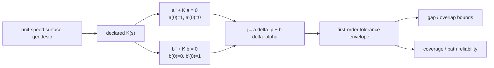

# Curved-Surface Geodesic Sensitivity

First-order path-sensitivity analysis for curved-surface manufacturing and
robotic inspection.

The first release propagates how initial lateral-position and heading changes
affect neighbouring geodesics. It turns those variations into deterministic
gap, overlap, coverage, and cross-track-error bounds.

This is the second project in the portfolio

> Computational Geometry, Geodesic Dynamics, and Invariant Representations

The [Flat-Torus Geodesic Reference](https://github.com/giasonpooni/Flat-Torus-Geodesic-Reference)
owns lattice shape, closed-loop lengths, and modular equivalence. This
repository owns numerical first variation along a declared surface geodesic.

## Delivered foundation

| Layer | Delivered behavior |
| --- | --- |
| Analytical reference | Exact Jacobi bases for constant positive, zero, and negative Gaussian curvature. |
| Numerical propagation | RK4 propagation for constant or varying declared curvature along arclength. |
| Finite-distance reference | Exact separation of constant-curvature geodesic rays for checking the first-order limit. |
| Tolerance propagation | Worst-case or explicitly selected RSS envelopes for starting position and heading. |
| Manufacturing contract | Minimum/maximum course spacing and deterministic gap/overlap bounds. |
| Inspection contract | Sensor-swath coverage margin, cross-track uncertainty, and a bounded reliability verdict. |
| Evidence | Reproducible JSON and Markdown reference reports with explicit claim scope and limitations. |

## Mathematical map



A Jacobi field is a first-order variation, not the exact finite distance
between trajectories. A geodesic segment is not thereby proved globally
shortest.

## Run

Python 3.12 or 3.13, NumPy, and `uv` are supported.

```bash
git clone https://github.com/giasonpooni/Curved-Surface-Geodesic-Sensitivity.git
cd Curved-Surface-Geodesic-Sensitivity
uv run --python 3.13 --dev pytest
uv run --python 3.13 python examples/write_reference_report.py
```

The example regenerates:

- `results/reference-report.json`
- `results/reference-report.md`

## Application example

```python
import numpy as np

from geodesic_testbed import (
    ManufacturingSpec,
    PathTolerance,
    assess_manufacturing,
    constant_curvature_trace,
)

s = np.linspace(0.0, 1.25, 126)
trace = constant_curvature_trace(s, curvature=-1.0)
assessment = assess_manufacturing(
    trace,
    ManufacturingSpec(
        course_width=0.100,
        initial_spacing=0.100,
        path_tolerance=PathTolerance(lateral=0.001, heading=0.001),
    ),
)
print(assessment.summary())
```

See [methods](docs/METHODS.md) for the mathematical contract and the
[industrial pilot](docs/INDUSTRIAL-PILOT.md) for the physical validation path.

## Scope boundary

This release consumes a declared Gaussian-curvature profile. It does not yet
trace geodesics on arbitrary CAD or mesh surfaces. It also does not model
machine servo error, material mechanics, tow compaction, weld-pool behavior,
or sensor probability of detection. Those effects require separate measured
models before an application can make an industrial process claim.

The report claim scope is `first-order-computational-analysis`. No SP1 guest,
authorization claim, CUDA stack, or duplicate finite-difference package is
introduced here.
