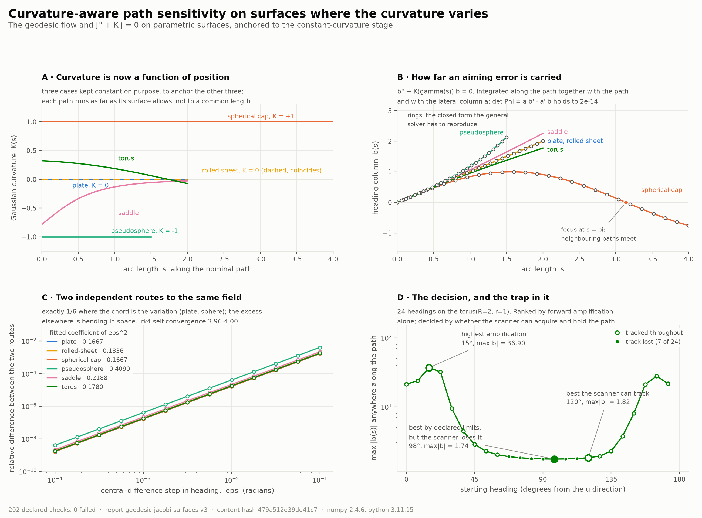
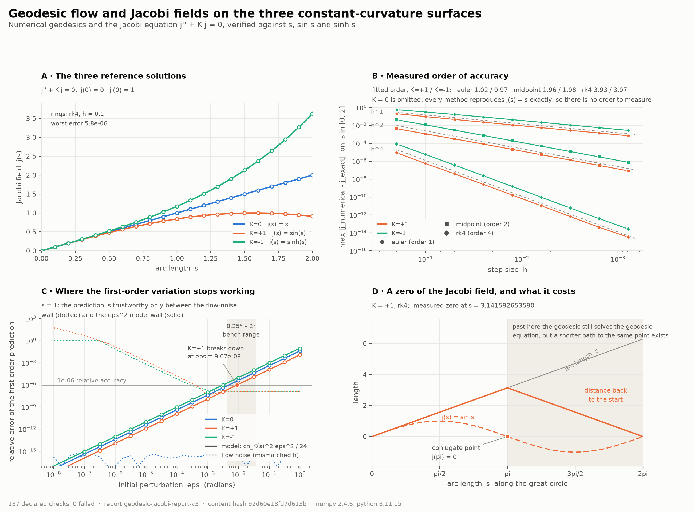

# Curved-Surface Geodesic Sensitivity

**How a small error in how a path is started grows into a deviation further
along a curved surface — and exactly how far that prediction can be trusted.**

Path sensitivity for curved-surface manufacturing and robotic inspection, in
two layers: deterministic tolerance contracts on top, and a numerical engine
underneath that is verified against everything it is possible to verify it
against.



## The object

A starting pose can be wrong in two ways: the tool begins *beside* the nominal
path, or *pointed away* from it. Both propagate through the same equation,

```text
j''(s) + K(gamma(s)) j(s) = 0
```

so the two fundamental solutions assemble into a transfer map

```text
        | a(s)   b(s) |          | lateral(s) |          | lateral(0) |
Phi(s) = |             |          |            | = Phi(s) |            |
        | a'(s)  b'(s)|          | heading(s) |          | heading(0) |

a(0)=1, a'(0)=0     (lateral offset)
b(0)=0, b'(0)=1     (heading error)
```

which carries a tolerance box, or a covariance, from the start of the path to
anywhere along it. It also carries its own invariant: the equation has no
first-derivative term, so `det Phi = a b' - a' b = 1` exactly, at every arc
length, on every surface — a quantity the solver never enforces and whose
drift is therefore a free measure of how well it is integrating.

## Verification

**235 declared checks across two stages, 0 failed.** Every number below has a
threshold attached in `engine/experiment.py` or `engine/experiment_surfaces.py`,
and the committed reports are regenerated and compared in CI.

### Stage one — constant curvature, where closed forms exist

All three surfaces are carried in one ambient chart, so the geodesic equation,
the exponential map, the distance function and the Jacobi reference each become
a single formula in `K` built from `sn_K = s, sin s, sinh s`.

| what was measured | result |
|---|---|
| order of accuracy, Euler / midpoint / RK4 | 1.02 / 1.96 / 3.93 (sphere), 0.97 / 1.98 / 3.97 (hyperbolic) |
| Wronskian drift order, same three methods | 0.97-1.03 / 3.000 / 4.998-5.002 — and matching the exact `\|d^n - 1\|` to 1e-11, 7e-6, 8e-7 |
| flat model | every method exact to `< 1e-13`; no order exists to measure, and the report says so |
| separation of two geodesics | `sn_K(d/2) = sn_K(s)·sin(eps/2)` — one law of cosines for all three curvatures |
| error of the first-order prediction | grows as `eps^2` with coefficient `cn_K(s)^2/24`, matched to 2e-5 … 4e-4 relative |
| first-order validity at `s = 1`, to 1e-6 | `eps <= 0.52°` (sphere), `0.28°` (plane), `0.18°` (hyperbolic) |
| conjugate point on the sphere | found at `s = 3.141592653589791`, error 2.2e-15 |
| loss of minimality past it | excess length matches `2(s - pi)` to 7.1e-15 |

The Wronskian row is worth a second look. Each fixed-step method has an exact
one-step determinant — `1 + Kh^2` for Euler, `1 + K^2h^4/4` for midpoint,
`(1 - Kh^2/2 + K^2h^4/24)^2 + K(h - Kh^3/6)^2` for RK4 — and the determinant of
a product is the product of determinants, so `det Phi = d^n` with no
approximation anywhere. Three more cleanly separated slopes, from a quantity
that needed no reference solution at all.

### Stage two — surfaces where the curvature varies

A parametric surface `r(u, v)` carries its own metric. From one jet come the
Christoffel symbols and the Gaussian curvature, and the geodesic and **both**
columns of `Phi` are advanced as one eight-component system. With no closed
form left, four things replace it:

| verification | result |
|---|---|
| **anchoring** — recover the known answers the general way | `b`: `s`, `s`, `sin s`, `sinh s` to 4.4e-13 or better; `a`: `1`, `1`, `cos s`, `cosh s` to 4.1e-13 or better |
| **two independent routes, twice** — `b` by perturbing the heading, `a` by moving the start point and parallel-transporting the direction | both second order in the perturbation on every surface, exponent 2.000 ± 0.001 |
| **self-convergence** — halve the step against a finer run | order 3.96 – 4.00 in `j`, 3.92 – 4.01 in the path, on every case with anything to converge |
| **invariants** — unit speed and `det Phi`, neither ever re-imposed | both hold to 2e-12 everywhere |

Three results worth stating plainly:

- **A rolled sheet has exactly the path sensitivity of the flat sheet** — to
  1e-13, from a completely different parameterisation. Bending a sheet onto a
  drum changes nothing, because only intrinsic curvature carries a pose error.
- **Reconstructed 3-D points give chords, not distances in the surface.** The
  finite-difference route differs from the Jacobi equation at order `eps^2`
  with coefficient `(cn_K(s)^2 + kappa_n^2 sn_K(s)^2)/6` — the second term
  being the ambient chord. On the pseudosphere the chord term is 1.45 times
  the intrinsic one, so a chord measurement sees 2.5 times the coefficient an
  in-surface distance would — the same order as the first-order model's own
  failure. A camera does
  not even report that directly: it reports image coordinates, and a chord
  appears only after calibration, reconstruction and registration. Every
  comparison in the reports therefore names its **observation mode**.
- **The two columns focus at different places.** On a spherical cap `b`
  vanishes at `s = pi` and `a` at `s = pi/2`. A heading error and a lateral
  offset are not interchangeable.

### The decision, and what is allowed to make it

Of 24 candidate starting headings from one point on a torus, forward angular
error amplification `max |b(s)|` varies by a factor of **21** over the same
path length. But the six best-scoring headings **all pass through a focus**,
where `|b|` drops to ~1e-4 — cheap forward separation bought with an
ill-conditioned endpoint map, proximity to a conjugate point, and path-family
crowding rather than coverage.

The tempting patch — demand a focus margin above some floor — is the wrong kind
of quantity: `|b|` has units of length per radian, so any floor is specific to
the part's size and to the angle unit, and is a number chosen here rather than
a property of the job. What replaces it is the observation model,

```text
dz(s) = Phi(s) dz0        y(s) = H(s) dz(s) + eta(s)
Cov(y) = H Phi C0 Phi^T H^T + R
```

from which the heading column's visibility to the sensor is the dimensionless

```text
rho(s) = |b(s)| * sigma_alpha / sigma_measurement
```

— 0.1° of aiming uncertainty against a 25 µm metrology system here, and checked
to be unchanged when the same physical situation is drawn at twice the size.
`rho(0) = 0` on every route, so it is applied as an acquisition *schedule*, not
a minimum: acquire above 5 within the first 1.0 of path length, hold above 3,
tolerate at most 0.1 of continuous loss, and report `TRACKED`,
`NEVER_ACQUIRED`, `LATE_ACQUISITION`, `TRACK_LOST` or
`INSUFFICIENT_TRACKED_DISTANCE`.

| | declared process limits | plus the scanner's schedule |
|---|---|---|
| feasible, of 24 | 15 | 8 |
| recommended | 97°, `max \|b\|` = 1.74 | 120°, `max \|b\|` = 1.82 |
| fate of 97° | feasible | `TRACK_LOST` from `s = 5.354` |

**5% more amplification, for a route the scanner can actually follow** — and
the seven routes it cannot follow are *exactly* the seven that pass through a
focus, two independent computations agreeing, as a declared check rather than
a remark. Note that 120° has a focus margin of 0.200: a hand-chosen floor of
0.25 would have rejected a route the instrument holds for the whole path.

That agreement is corroboration under one configuration, not an identity, and
the check is named for the configuration. A geometric focus is a zero of a
transfer column and belongs to the surface; resolvability belongs to the whole
chain, and the two come apart in both directions. Shrink the admitted heading
tolerance by 10⁴ and the plate — whose `b(s) = s` never vanishes — drops to
`rho` = 0.0042 everywhere, unresolvable with no focus in it. Stand 0.01 before
the sphere's conjugate point and 1.0 µm metrology on a 300 mm coupon resolves
it, because `|b|` beside a focus is small but not zero. Both are declared
checks, and both quantities stay in the report.

The ranking scalar is therefore named
`minimum-forward-angular-error-amplification`, not robustness, and it decides
nothing. Boundary clearance, curvature exposure and path length are declared in
`RouteConstraints` and left unbounded in this example; accumulated
observability `W = ∫ Phi^T H^T R^-1 H Phi ds` is not computed at all.



## Run

```bash
uv sync --locked --extra dev          # or: pip install -e ".[dev]"
uv run pytest -q                      # 283 tests, no network, about three minutes
uv run python examples/run_experiment.py --out out        # both stages: reports + figures
uv run python examples/write_reference_report.py          # application reference report
```

`--stage constant-curvature` or `--stage surfaces` runs one of them;
`--update-committed` refreshes the tracked reports and figures. The command
exits non-zero if any declared check fails, so it gates CI by itself.

## Using it

```python
import numpy as np

from geodesic_testbed import (
    ManufacturingSpec,
    PathTolerance,
    assess_manufacturing,
    constant_curvature_trace,
)

s = np.linspace(0.0, 1.25, 126)
trace = constant_curvature_trace(s, curvature=-1.0)
assessment = assess_manufacturing(
    trace,
    ManufacturingSpec(
        course_width=0.100,
        initial_spacing=0.100,
        path_tolerance=PathTolerance(lateral=0.001, heading=0.001),
    ),
)
print(assessment.summary())
```

For a real surface rather than a declared curvature profile, the engine takes
`r(u, v)` and returns the envelope directly:

```python
from geodesic_testbed.engine.envelope import integrate_path
from geodesic_testbed.engine.surfaces import torus

envelope = integrate_path(torus(2.0, 1.0), u0=0.3, v0=0.2, heading=0.6,
                          length=2.0, n_steps=2000)
phi = envelope.transfer_map
print(phi.worst_case_offset(lateral=1e-3, heading=1e-3)[-1])
print(envelope.summary()["focus_points"])
```

## Layout

| package | what lives there |
|---|---|
| `geodesic_testbed` | the public API: `PathTolerance`, manufacturing and inspection assessments, the reference report |
| `geodesic_testbed.engine` | the verified numerical core: space forms, parametric surfaces, integrators, transfer maps, envelopes, observation modes, both experiment stages and their figures |

There is one integrator and one transfer map; `geodesic_testbed.jacobi`
delegates to the engine rather than carrying a second copy.

[`docs/METHODS.md`](docs/METHODS.md) is the mathematical contract,
[`docs/EXPERIMENT.md`](docs/EXPERIMENT.md) and [`docs/SURFACES.md`](docs/SURFACES.md)
the two verification stages in full, [`docs/INSTRUMENT.md`](docs/INSTRUMENT.md)
the interpretation and validation limits, and
[`docs/MEASUREMENT.md`](docs/MEASUREMENT.md) the implemented observation,
filtering and tracking contracts. [CONTRIBUTING.md](CONTRIBUTING.md) records
the contributor invariants.

## Scope

Stage one's `claim_scope` is `numerical-verification-against-closed-form-solutions`;
stage two's is `numerical-verification-anchored-to-the-constant-curvature-stage`
and names stage one as its dependency; the application report's is
`first-order-computational-analysis`. Five boundaries are kept explicit:

- A Jacobi field is a first-order variation, not the exact finite distance
  between trajectories. The size of that gap is measured here, not waved at.
- Finding a geodesic does not establish that an arbitrarily long segment is
  globally shortest. Past the conjugate point on the sphere it demonstrably is
  not, and the experiment measures by how much.
- The envelope is first order. `Phi(s)` maps a starting pose error to a
  downstream one linearly; stage one measures where that stops being true.
- Meshes are out of scope here; this runtime provides parametric-surface
  geometry and does not contain a triangle-mesh solver.
- **No physical measurement exists in this repository.** Nothing here models
  machine servo error, material mechanics, tow compaction, weld-pool behaviour
  or sensor probability of detection. Numerical verification does not establish
  agreement with a physical instrument; physical validation is `not_started`.

## Portfolio context

Second project in

> Computational Geometry, Geodesic Dynamics, and Invariant Representations

The [Flat-Torus Geodesic Reference](https://github.com/giasonpooni/Flat-Torus-Geodesic-Reference)
owns lattice shape, closed-loop lengths and modular equivalence; exact torus
lengths stay algebraic and stay there. This repository owns numerical first
variation along a surface geodesic. No SP1 guest, no authorization claim, no
CUDA stack. The corpus cite is
[`docs/invariant-corpus-cite-v1.md`](docs/invariant-corpus-cite-v1.md).

## License

MIT — see [LICENSE](LICENSE).
