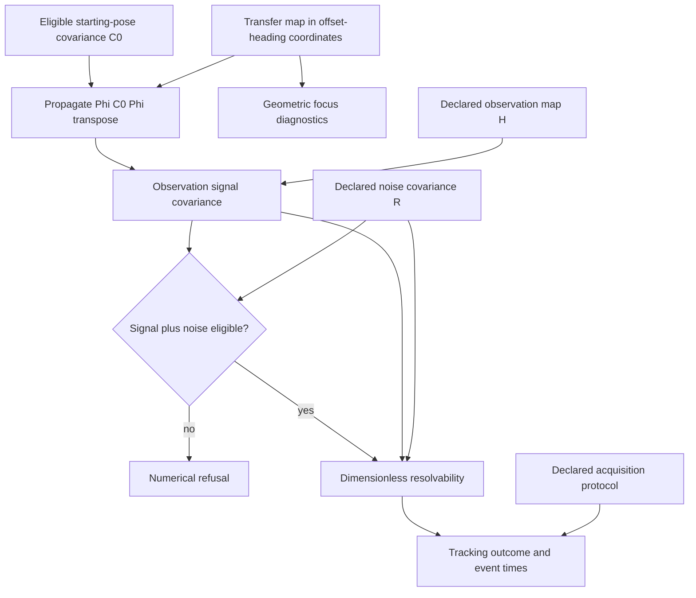

# Curved Surface Geodesic Sensitivity Runtime in the instrumentation stack

Notation Systems develops computational instrumentation and evidence infrastructure for industrial and cyber-physical systems.
This component owns **curvature-dependent path sensitivity**. The [stack map](https://github.com/giasonpooni/Computational-Instrumentation-Workbench/blob/main/docs/STACK.md) locates all public components and distinguishes implemented paths from specifications and scaffolds.

## Current boundary

| Property | Scope |
| --- | --- |
| Implementation | Executable numerical engine and tolerance experiments |
| Workbench connection | Standalone; flat-reference companion boundary |
| Inputs | Declared surfaces, geodesic initial data, perturbations and numerical/tolerance settings. |
| Outputs | Geodesic and Jacobi-field diagnostics, transfer maps, sensitivity and bounded tolerance reports. |

Numerical reference checks support their stated computational scope. They do not establish scanner calibration, robot dynamics or production inspection accuracy.

## Sensitivity and observation uncertainty

Solid arrows show implemented numerical modules, conditional on their declared inputs. H specifies the observation coordinates. Signal covariance and noise R remain separate for resolvability, while the reported observation covariance is their sum. Covariance eligibility and positive noise requirements do not establish calibration. Focus diagnostics belong to the geometry; resolvability and acquisition timing also depend on the observation model and protocol. No physical sensor, command path or verification authority is represented.

[Instrumentation diagram atlas](https://github.com/giasonpooni/Computational-Instrumentation-Workbench/blob/main/docs/DIAGRAMS.md).

## Interoperability

Integrations use the component's documented contract and an explicit adapter. They preserve source observations, ordered quantities, units, coordinate/frame meaning, time semantics, missingness and declared uncertainty where applicable. An unimplemented field or conversion must be reported as unsupported rather than silently inferred.

Evidence identity names the source record; operation identity names the versioned computation; execution identity names an invocation; result identity names its output; verification identity names a scoped check. These are integration requirements, not a claim that every standalone repository already implements all five record types.

Display names and repository locations do not rename packages, schemas, operation IDs, retained corpus keys or historical runtime pins. CIW integrations use the exact source revisions named in its runtime manifests and operating guides; a provider's current default branch is not a substitute for that binding. Published numerical records retain their original run scope.

## Technical references

- [Overview and runnable instructions](../README.md)
- [docs/INSTRUMENT.md](INSTRUMENT.md)
- [docs/METHODS.md](METHODS.md)
- [docs/SURFACES.md](SURFACES.md)

Private customer state, deployment configuration and calibration knowledge are outside this public component description. Applicable repository licenses and source-data rights remain controlling; a shared stack identity is not a license grant or a change of repository visibility.
